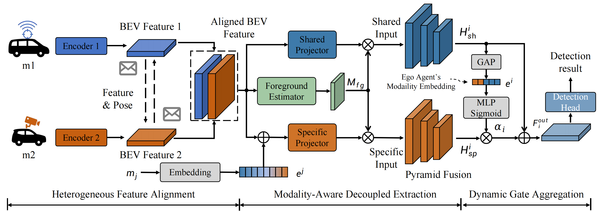
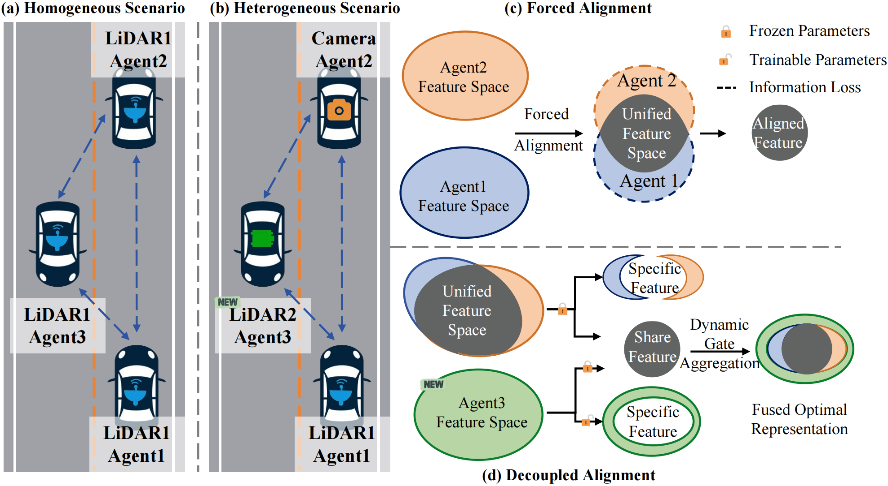
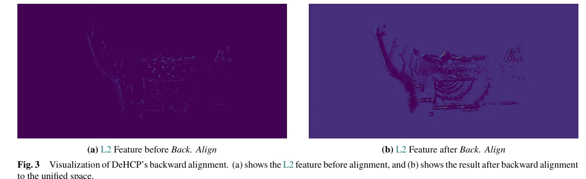
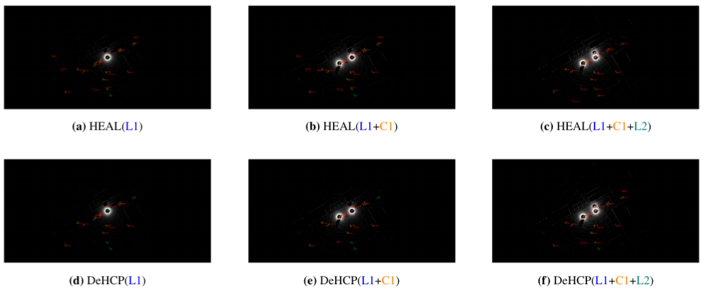

# DeHCP: A Decoupled Framework for Scalable Open Heterogeneous Collaborative Perception

This repository provides the implementation and reproduction guide for **DeHCP**. DeHCP is designed for **open heterogeneous collaborative perception**, where agents may differ in sensor modality, encoder architecture, and participation over time.

Instead of forcing all heterogeneous features into a single unified space, DeHCP explicitly decouples the intermediate feature representation into:

- `shared branch`: extracts modality-agnostic common representations across agents
- `specific branch`: preserves modality-specific complementary information from sensors such as cameras and LiDARs
- `dynamic gate aggregation`: adaptively fuses shared and specific features according to the global semantic context and the ego agent identity
- `backward alignment`: integrates newly joined heterogeneous agents by updating only local encoders and lightweight adapters, without full collective retraining

Our implementation is based on [HEAL](https://github.com/yifanlu0227/HEAL), and follows the same engineering organization. Therefore, the **installation process, dataset organization, and basic training entry points are consistent with the reference repository**.



## Highlights

- Designed for open-world heterogeneous collaborative perception, supporting the progressive integration of new modalities and new models
- Reduces the information loss caused by forced feature alignment through shared-specific decoupling
- Uses modality embeddings and dynamic gating to preserve modality-specific advantages

## Method Overview

The key idea of DeHCP is to maintain cross-modal compatibility for collaboration without sacrificing the informative characteristics of heterogeneous sensors.



## Experimental Results

The paper evaluates collaborative detection performance on **OPV2V-H** under a sequential agent integration setting. Compared with HEAL, DeHCP consistently achieves better performance across all stages, especially under the stricter `AP70` metric.



The figure above visualizes the effect of backward alignment. After alignment, the feature distribution of the newly introduced agent becomes much more consistent with the established collaborative space.

| Method | AP50 (+CE(384)) | AP50 (+LS(32)) | AP50 (+CR(336)) | AP70 (+CE(384)) | AP70 (+LS(32)) | AP70 (+CR(336)) |
| --- | ---: | ---: | ---: | ---: | ---: | ---: |
| HEAL | 0.826 | 0.892 | 0.894 | 0.726 | 0.812 | 0.813 |
| **DeHCP** | **0.833** | **0.895** | **0.899** | **0.733** | **0.817** | **0.822** |

DeHCP not only preserves cross-modal compatibility, but also better exploits the complementary strengths of cameras and LiDARs, leading to improved 3D object detection accuracy.



The qualitative results further show that DeHCP produces predictions closer to the ground truth as new agents are gradually added, demonstrating stronger robustness in open heterogeneous collaboration.

## Installation

The installation procedure is the same as the reference repository:

- Reference repository: [HEAL](https://github.com/yifanlu0227/HEAL)
- Environment: Python 3.8, PyTorch 1.12.0, CUDA 11.6

### Step 1: Basic Installation

```bash
conda create -n dehcp python=3.8
conda activate dehcp

conda install pytorch==1.12.0 torchvision==0.13.0 torchaudio==0.12.0 cudatoolkit=11.6 -c pytorch -c conda-forge

pip install -r requirements.txt
python setup.py develop
```

### Step 2: Install Spconv

This project supports both `spconv 1.2.1` and `spconv 2.x`.

- If you prefer easier installation, we recommend `spconv 2.x`
- If you need compatibility with older checkpoints, use `spconv 1.2.1`

For example, under `CUDA 11.6`, you can install:

```bash
pip install spconv-cu116
```

If you need `spconv 1.2.1`, please refer to the official instructions:

- [spconv v1.2.1](https://github.com/traveller59/spconv/tree/v1.2.1)
- [spconv installation table](https://github.com/traveller59/spconv#spconv-spatially-sparse-convolution-library)

### Step 3: Compile CUDA Ops

```bash
python opencood/utils/setup.py build_ext --inplace
```

### Step 4: FPV-RCNN Dependencies (Optional)

```bash
python opencood/pcdet_utils/setup.py build_ext --inplace
```

### Step 5: Prepare Modality Assignment

To stay consistent with the reference implementation, prepare the log directory and copy the modality assignment files under the repository root:

```bash
mkdir -p opencood/logs
cp -r opencood/modality_assign opencood/logs/heter_modality_assign
```

## Data Preparation

The reference implementation supports multiple collaborative perception datasets. The DeHCP paper mainly reports results on **OPV2V-H**.

- `OPV2V`: see [OpenCOOD](https://github.com/DerrickXuNu/OpenCOOD)
- `OPV2V-H`: see [OPV2V-H on Hugging Face](https://huggingface.co/datasets/yifanlu/OPV2V-H)

Please create a `dataset/` directory under the repository root and keep the structure consistent with the reference repository:

```text
dataset/
├── OPV2V
│   ├── additional
│   ├── test
│   ├── train
│   └── validate
├── OPV2V_Hetero
│   ├── test
│   ├── train
│   └── validate
```

## DeHCP Training Protocol

DeHCP follows the same two-stage open heterogeneous training protocol described in the paper.

### Stage 1: Train the Collaboration Base

The first stage builds the collaboration base using the base agent type. In the paper, the initial base is `64-line LiDAR + PointPillars`.

```bash
python opencood/tools/train.py -y None --model_dir opencood/hypes_yaml/opv2v/MoreModality/DeHCP/stage1/m1_pyramid.yaml
```

### Stage 2: Align New Agent Types

After obtaining the best checkpoint from Stage 1, freeze the shared branch and the detection backend, and perform backward alignment for each newly introduced agent type.

```bash
python opencood/tools/train.py -y None --model_dir opencood/hypes_yaml/opv2v/MoreModality/DeHCP/stage2/m2_single_pyramid.yaml
python opencood/tools/train.py -y None --model_dir opencood/hypes_yaml/opv2v/MoreModality/DeHCP/stage2/m3_single_pyramid.yaml
python opencood/tools/train.py -y None --model_dir opencood/hypes_yaml/opv2v/MoreModality/DeHCP/stage2/m4_single_pyramid.yaml
```

### Stage 3: Merge and Evaluate

Merge the aligned new-agent checkpoints with the collaboration base, and then run open heterogeneous inference:

```bash
python opencood/tools/inference_heter_in_order.py --model_dir opencood/hypes_yaml/opv2v/MoreModality/DeHCP/final_infer/m1m2m3m4.yaml
```

## Acknowledgement

Special thanks to the following projects:

- [HEAL](https://github.com/yifanlu0227/HEAL)
- [OpenCOOD](https://github.com/DerrickXuNu/OpenCOOD)
- [CoAlign](https://github.com/yifanlu0227/CoAlign)
